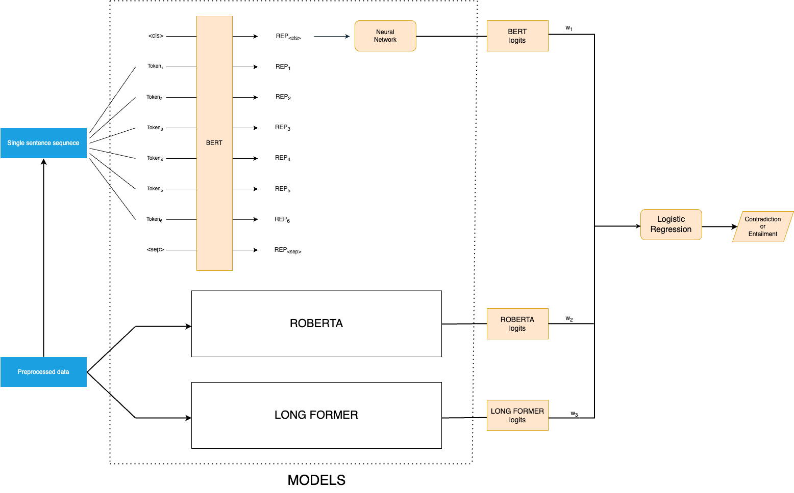

## LLMs in Health Science
This project invloves in creating LLMs to analyze breast cancer clinical trial reports (CTRs), which is helpful for the healthcare professionals in decision-making.
We use MedBERT, MedRoBERTa, and Longformer—models pre-trained on medical data—to evaluate the truthfulness of statements within CTRs. Finally used ensemble learning with logistic regression to combine the strength of each model.
This model helps the reliability of AI in medical domain, supporting healthcare professionals to analyze the data.

* The main task is to predict whether the statement is contradicts or entails with the data in the CTR.

The repository contains the code and models with the links to submit your reults
## Prerequisites
* Upload the training_data.zip in drive

* Run the files using GPU(A100) to fine tune the models. 

## More about Dataset and submission of results

To get more information about the dataset 
[SemEval 2024 Task 2: Safe Biomedical Natural Language Inference for Clinical Trials](https://codalab.lisn.upsaclay.fr/competitions/16190#learn_the_details-overview)

Submit the results from your predictions in results.json.zip file by uploading all the predictions in `NLP_results.ipynb`

## Setup for the model

1. Clone the repository

```bash
https://github.com/RamanaNani/LLMs-in-Health-Science.git
```
2. Access data
   Download the training_data and give the correct path to load the data.

## Training and Finetunning the model
1. Import all the required libraries
  
2. Run `NLP_Basemodels.ipynb` to get the baseline predictions and see how the preprocessing is working
   
3. Fine tune the models by getting the pretrained weights from [Hugging Face](https://huggingface.co/) which are pretrained on medical corpora.
   
4. Run `NLP_MedBert.ipynb` to fine tune MedBERT and get the predictions.
   
5. Run `NLP_MedRoBERTa.ipynb` to fine tune MedRoBERTa and get the predictions.
    
6.  Run `NLP_Longformer.ipynb` to fine tune Longformer and get the predictions.
    
7.  Save the weights of all the three models which are fine tuned on pretrained models.
    
8.  Load the weights in `NLP_Ensemble_Learning.ipynb` and run the `NLP_Ensemble_Learning.ipynb` to get the predictions for Ensembling model with logistic regression.
    
9.  Use `NLP_results.ipynb` to convert prediction to submit the results in json file as mentioned in the [SemEval 2024 Task 2: Safe Biomedical Natural Language Inference for Clinical Trials](https://codalab.lisn.upsaclay.fr/competitions/16190#learn_the_details-overview)
  
10.  Submit the results and see the score of faithfulness and consistency.

## Additional Information
Models which are pretrained on medical corpora are getting better results as compared to base models. Try with Data Augmentation which may result in better predictions.

## Architecture


